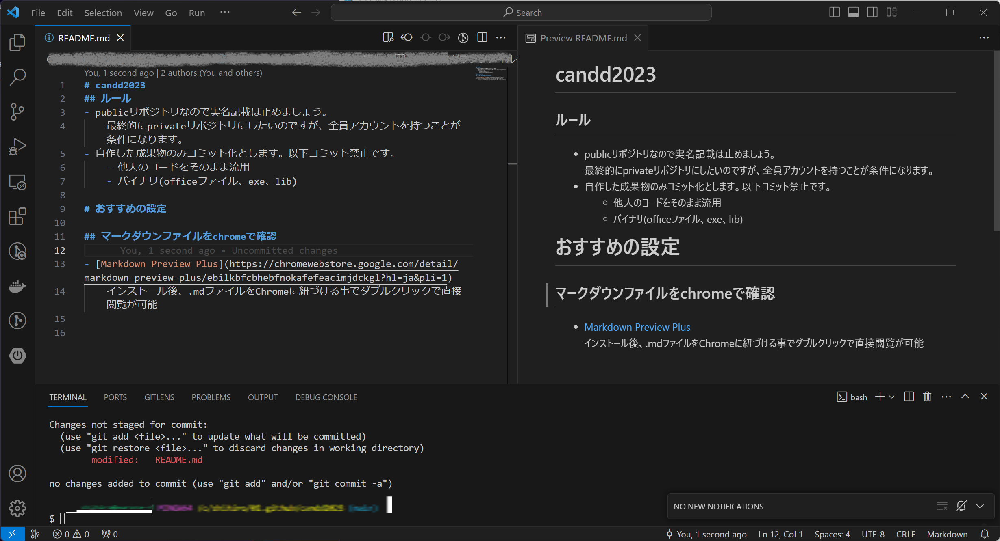

# candd2023
## ルール
- publicリポジトリなので実名記載は禁止。  
    privateリポジトリは利用者全員アカウントを持つことが必須条件。
- 自作した成果物のみコミット可。以下はコミット禁止。
    - 他人のコードをそのまま流用すること。
    - バイナリ(officeファイル、exe、lib)ファイルのコミット。  
        ※手順書目的など500kb程度の小さい画像なら可。

## Markdownファイルの編集について
おすすめの設定などを共有

### マークダウンファイルをchromeで確認
- [Markdown Preview Plus](https://chromewebstore.google.com/detail/markdown-preview-plus/ebilkbfcbhebfnokafefeacimjdckgl?hl=ja&pli=1)  
    インストール後、.mdファイルをChromeに紐づける事でダブルクリックで直接閲覧が可能

### VsCodeを活用
- VsCodeにはマークダウンのプレビュー機能がある
- Terminalを使えば画面内でプレビューを見ながらGit操作ができる

