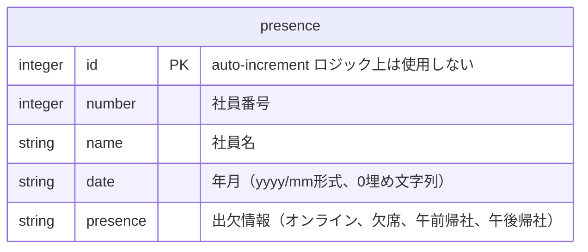
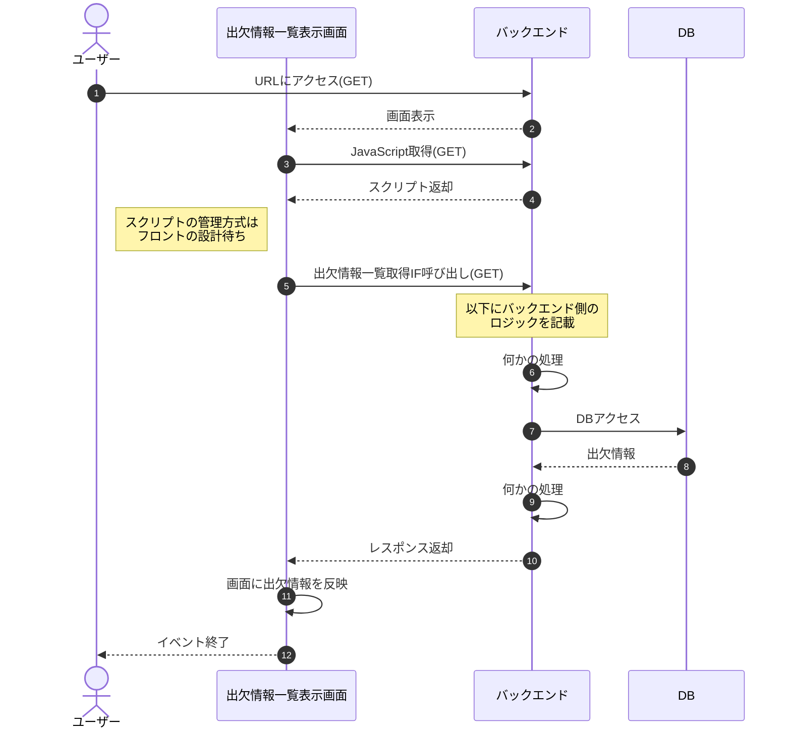

# 出欠管理システム 詳細設計書

Wordでキッチリしたドキュメントにする必要ある？  
→作業時間がいたずらに増える＆体裁を整えても学習効果は少ない（工数に見合わない）と判断  
→Markdownで押し切りたい

## システム構成

- 構成図要る？（画像埋め込みになるのでできれば避けたい）
- 動作環境・ドメインなどの基本仕様
- 備考（運用面や責任範囲など、何か書くことあれば）

## DB設計

バックエンド側のデータベース設計を以下に示す。



## シーケンス

バックエンド側の各処理について、シーケンスを以下に示す。  

### サーバ起動時 処理シーケンス
※無い場合は記載不要（件のDB初期設定などが明示的に必要ならここに来るかも）

### 出欠情報一覧取得IF 処理シーケンス



### 出欠情報更新IF 処理シーケンス

```mermaid
%% ここにシーケンスを記述
sequenceDiagram
    autonumber
```
